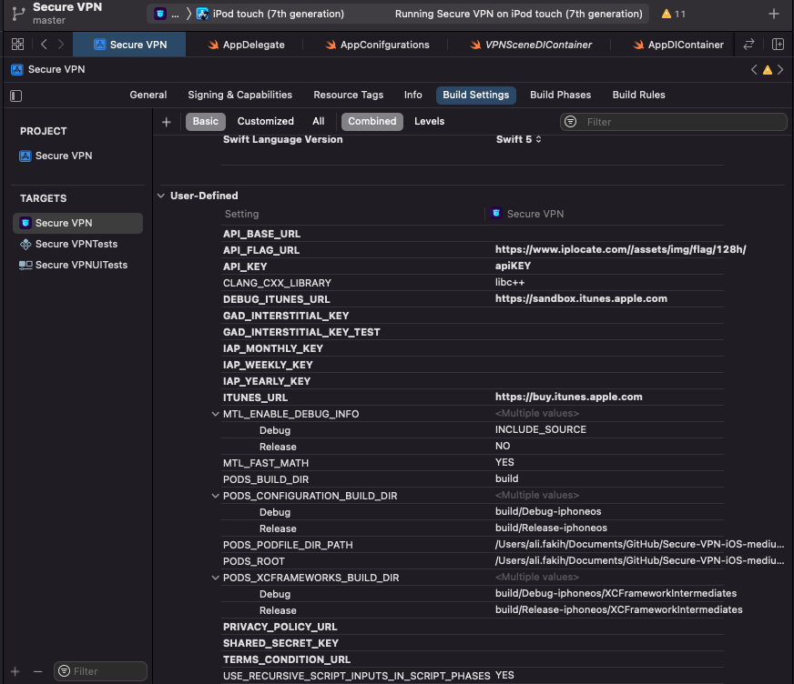

# SecureVPN
[Medium Article](https://fakiho.medium.com/build-an-ios-app-with-a-revenue-1-338-mo-2d5e5288c9fd) 

A full tutorial will walk with you step by step


## Before we begin

This tutorial is designed for software developers who like to learn advanced swift. This tutorial will give you enough understanding of swift and how to build an APP from scratch. I would love to help developers to build their own apps with clean code way. While most of the tutorials are not a really good reference for building an app, you are going to see here a full tutorial on how to start building an application following an MVVM architecture and integrating in-app purchase.

Before proceeding with this tutorial, you should have a basic understanding of Computer Programming terminologies and a knowledge of programming language.

So, if you are a beginner and you don't know too much about swift, it is ok you can follow, but the best is to get more in swift first, and then you start this tutorial because we will not gonna get in basic swift details.


## Application Architecture

When we develop software, it is important not only to use design patterns but also architectural patterns. There are many different architectural patterns in software engineering. 

In Mobile software engineering, the most widely used are MVVM, Clean architecture, and Redux patterns


## Architecture concepts used here 📚

Clean Architecture https://blog.cleancoder.com/uncle-bob/2012/08/13/the-clean-architecture.html

Advanced iOS App Architecture https://www.raywenderlich.com/8477-introducing-advanced-ios-app-architecture

MVVM

Data Binding

Dependency Injection

SwiftUI and UIKit view implementations by reusing the same ViewModel (at least Xcode 11 required)

## Requirements
Xcode Version 11.2.1+ Swift 5.0+

## Getting Started

### Setup 🛠
You must install [bundler](https://bundler.io) and [brew](https://brew.sh)

when all is ready, in your terminal run

```bash
$ brew install npm
```

When the npm installation is finished run the setup command
```bash
$ make pods_install
```
## Build
You will need to add the keys to make sure the project successfully launched


fastlane documentation
----

# Installation

Make sure you have the latest version of the Xcode command line tools installed:

```sh
xcode-select --install
```

For _fastlane_ installation instructions, see [Installing _fastlane_](https://docs.fastlane.tools/#installing-fastlane)

# Available Actions

## iOS

### ios custom_lane

```sh
[bundle exec] fastlane ios custom_lane
```

Description of what the lane does

### ios install_pods

```sh
[bundle exec] fastlane ios install_pods
```

Install applications pod dependencies

----

This README.md is auto-generated and will be re-generated every time [_fastlane_](https://fastlane.tools) is run.

More information about _fastlane_ can be found on [fastlane.tools](https://fastlane.tools).

The documentation of _fastlane_ can be found on [docs.fastlane.tools](https://docs.fastlane.tools).
